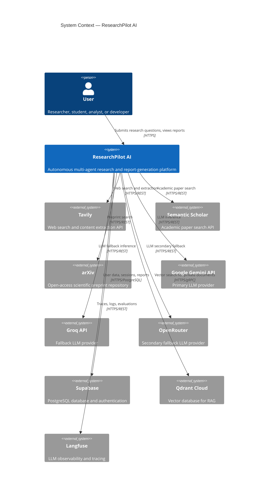
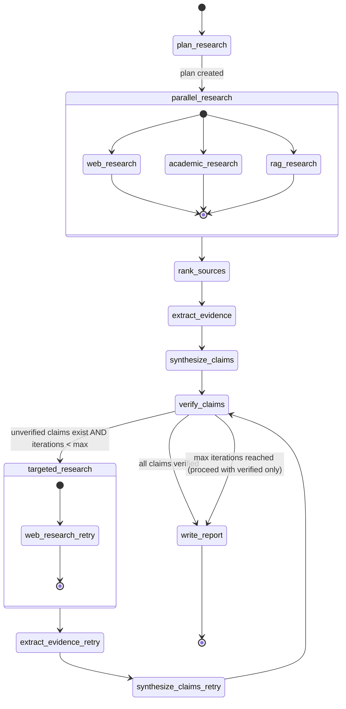
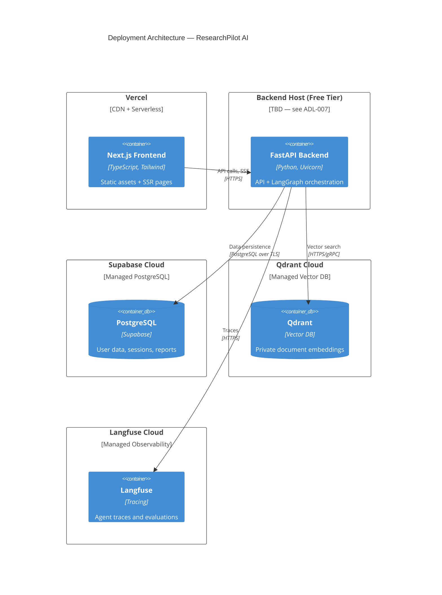

# ARCHITECTURE.md — System Architecture Document

> **Status:** Specification Frozen
> **Version:** 1.0.0
> **Last Updated:** 2026-09-16
> **Owner:** ResearchPilot AI Project

---

## Table of Contents

1. [Architecture Goals](#architecture-goals)
2. [Architecture Principles](#architecture-principles)
3. [System Context](#system-context)
4. [Frontend Architecture](#frontend-architecture)
5. [Backend Architecture](#backend-architecture)
6. [Agent Architecture](#agent-architecture)
7. [LangGraph Flow](#langgraph-flow)
8. [Controlled Loop](#controlled-loop)
9. [LLM Architecture](#llm-architecture)
10. [Research Tool Architecture](#research-tool-architecture)
11. [Data Flow](#data-flow)
12. [External Services](#external-services)
13. [Deployment Architecture](#deployment-architecture)
14. [Security Architecture](#security-architecture)
15. [Scalability](#scalability)
16. [Architectural Decision Log](#architectural-decision-log)

---

## Architecture Goals

1. **Correctness over speed** — The research pipeline must prioritize verified, citation-backed output over raw throughput.
2. **Composability** — Every agent, tool, and LLM provider must be independently replaceable without modifying unrelated code.
3. **Transparency** — Every agent action, LLM call, and tool invocation must be traceable via Langfuse.
4. **Resilience** — A failure in any single external service must not crash an entire research session.
5. **Free-tier compatibility** — The initial system must run entirely on free-tier infrastructure. The architecture must not depend on paid-tier features to function.
6. **Upgrade-ready** — Architectural decisions must not require a rewrite to scale beyond the free tier.

---

## Architecture Principles

| Principle | Implication |
|-----------|-------------|
| **Separation of concerns** | API layer, graph orchestration, agent logic, and tool implementations are separate modules |
| **Async-first** | All I/O — LLM calls, tool calls, database queries — must be non-blocking |
| **Stateless agents** | Agents receive full context per invocation; no agent-level session state |
| **Provider abstraction** | Agents call an LLM router, not a specific provider |
| **Schema-first data** | Pydantic models define all inter-agent data contracts before implementation |
| **Fail gracefully** | Retries with exponential backoff; no silent failures; structured error propagation |
| **Minimum viable infrastructure** | No queues, message brokers, or orchestration systems until they are proven necessary |
| **Explicit over implicit** | Configuration in environment variables; no hidden defaults that break under load |

---

## System Context



---

## Frontend Architecture

### Technology

- **Framework:** Next.js (App Router)
- **Language:** TypeScript
- **Styling:** Tailwind CSS
- **Deployment:** Vercel

### Responsibilities

| Responsibility | Implementation |
|----------------|----------------|
| Research question input form | Client component with validation |
| Research option configuration (P1) | Client component |
| Research progress display | SSE consumer, streaming UI updates |
| Agent activity log display | State derived from SSE events |
| Report rendering | Server-rendered Markdown → HTML |
| Citation display | Inline citation components linked to source list |
| Document upload (P1) | Client-side file validation + multipart POST |
| Authentication UI | Supabase Auth UI or custom form |
| Research history list | Server component with database query |
| Export trigger | Client-side Markdown download; PDF via API (P1) |

### Client/Server Boundaries

```
Server Components:
  - Layout, navigation
  - Research history list (fetches from DB)
  - Completed report view (fetches report from DB)
  - SEO metadata

Client Components:
  - Research question form
  - Research progress stream consumer
  - Agent activity live display
  - Any interactive UI element requiring browser APIs
```

### Authentication Interaction

- Supabase Auth handles session management via HTTP-only cookies.
- Next.js middleware validates session on protected routes.
- The backend API validates the JWT on every protected request.
- The frontend **never** receives or stores LLM API keys.

### API Communication

- All backend calls go through Next.js API routes (proxied) or directly from the client to the backend FastAPI — **TBD: Decision Required** on whether to use Next.js as a BFF (Backend for Frontend) or call FastAPI directly.
- Recommended: Call FastAPI directly from the client for streaming (SSE); use Next.js API routes for non-streaming data if needed.

---

## Backend Architecture

### Layer Diagram

```
┌──────────────────────────────────────────────────────────────┐
│  API Layer (FastAPI)                                         │
│  - Request validation                                        │
│  - Authentication middleware                                 │
│  - Rate limiting                                             │
│  - SSE endpoint                                              │
│  - Response serialization                                    │
└───────────────────────────┬──────────────────────────────────┘
                            │
┌───────────────────────────▼──────────────────────────────────┐
│  Application Services                                        │
│  - ResearchService: orchestrates session lifecycle           │
│  - ReportService: fetches and formats reports                │
│  - DocumentService (P1): handles document upload/processing  │
│  - UserService: user profile operations                      │
└───────────────────────────┬──────────────────────────────────┘
                            │
┌───────────────────────────▼──────────────────────────────────┐
│  LangGraph Orchestration Layer                               │
│  - ResearchGraph: defines state machine                      │
│  - State schema: ResearchState (Pydantic)                    │
│  - Node routing logic                                        │
│  - Conditional edges                                         │
│  - Parallel node execution                                   │
└───────────────────────────┬──────────────────────────────────┘
                            │
┌───────────────────────────▼──────────────────────────────────┐
│  Agent Layer                                                 │
│  - PlannerAgent                                              │
│  - WebResearchAgent                                          │
│  - AcademicResearchAgent (P1)                                │
│  - PrivateRAGAgent (P1)                                      │
│  - SourceRanker                                              │
│  - EvidenceExtractor                                         │
│  - SynthesisAgent                                            │
│  - CriticAgent                                               │
│  - WriterAgent                                               │
└──────────┬────────────────┬─────────────────────────────────┘
           │                │
┌──────────▼──────┐  ┌──────▼──────────────────────────────────┐
│  Tool Layer     │  │  LLM Layer                              │
│  - TavilyTool   │  │  - LLMRouter                            │
│  - SemanticScholarTool│  │  - GeminiProvider                │
│  - ArXivTool    │  │  - GroqProvider                         │
│  - QdrantTool   │  │  - OpenRouterProvider                   │
└──────────┬──────┘  │  - RetryStrategy                        │
           │         └──────┬──────────────────────────────────┘
           │                │
┌──────────▼────────────────▼──────────────────────────────────┐
│  Data Layer                                                  │
│  - Supabase PostgreSQL (async client)                        │
│  - Qdrant Cloud (async vector client)                        │
└──────────────────────────────────────────────────────────────┘
```

### Layer Responsibilities

| Layer | Responsibility | Must NOT |
|-------|----------------|----------|
| **API Layer** | HTTP routing, auth middleware, request validation, SSE | Contain business logic; call agents directly |
| **Application Services** | Orchestrate database + graph; manage session state | Call LLM directly; contain graph logic |
| **LangGraph Layer** | Define state machine, edge routing, parallelism | Manage HTTP connections; write to database directly |
| **Agent Layer** | Implement research reasoning using tools and LLM | Contain HTTP routing logic; manage LangGraph state |
| **Tool Layer** | Wrap external APIs with retry/error handling | Contain reasoning logic; call LLM directly |
| **LLM Layer** | Abstract provider selection; retry; structured output | Contain agent logic; know about research domain |
| **Data Layer** | Read/write to Postgres and Qdrant | Contain business logic |

---

## Agent Architecture

### Planner Agent

| Property | Detail |
|----------|--------|
| **Input** | `research_question: str`, `config: ResearchConfig` |
| **Output** | `ResearchPlan`: list of `SubQuestion` objects with assigned research types |
| **Responsibility** | Decompose the user's question into 2–8 specific, answerable sub-questions. Assign each sub-question a research type (web, academic, rag). |
| **Tools** | None — LLM-only reasoning |
| **Must NOT** | Search the web; generate evidence; produce claims; use more than one LLM call per invocation |

### Web Research Agent

| Property | Detail |
|----------|--------|
| **Input** | `sub_question: SubQuestion`, `session_id: UUID` |
| **Output** | `ResearchResult`: list of `Source` objects with `evidence_snippets` |
| **Responsibility** | Use Tavily to search for the sub-question. Extract relevant content. Return structured sources with evidence snippets. |
| **Tools** | `TavilyTool` (search + extract) |
| **Must NOT** | Generate claims; synthesize across sources; call LLM for reasoning beyond extraction |

### Academic Research Agent (P1)

| Property | Detail |
|----------|--------|
| **Input** | `sub_question: SubQuestion`, `session_id: UUID` |
| **Output** | `ResearchResult`: list of academic `Source` objects |
| **Responsibility** | Search Semantic Scholar and arXiv. Return structured paper records with abstract excerpts as evidence. |
| **Tools** | `SemanticScholarTool`, `ArXivTool` |
| **Must NOT** | Access full paper PDFs without explicit download step; generate claims |

### Private RAG Agent (P1)

| Property | Detail |
|----------|--------|
| **Input** | `sub_question: SubQuestion`, `user_id: UUID`, `session_id: UUID` |
| **Output** | `ResearchResult`: list of `Source` objects from private document collection |
| **Responsibility** | Embed the sub-question. Query the user's private Qdrant collection. Return matched document chunks as evidence. |
| **Tools** | `QdrantTool` |
| **Must NOT** | Access another user's vector collection; store retrieved content outside session |

### Source Ranker

| Property | Detail |
|----------|--------|
| **Input** | `sources: list[Source]` |
| **Output** | `sources: list[Source]` with updated `credibility_score` and `relevance_score` |
| **Responsibility** | Score each source. Heuristics: domain type (`.edu`, `.gov`, `.ac.*` score higher), publication type (peer-reviewed > blog), snippet relevance. Low-credibility sources are flagged, not removed. |
| **Tools** | None — heuristic + LLM scoring |
| **Must NOT** | Remove sources without flagging; alter evidence content |

### Evidence Extractor

| Property | Detail |
|----------|--------|
| **Input** | `sources: list[Source]`, `sub_questions: list[SubQuestion]` |
| **Output** | `evidence_items: list[Evidence]` mapped to sub-questions |
| **Responsibility** | For each source, extract verbatim snippets most relevant to each sub-question. Create structured `Evidence` objects with source reference. |
| **Tools** | LLM (extraction prompt) |
| **Must NOT** | Paraphrase or alter evidence text; invent evidence not present in source content |

### Synthesis Agent

| Property | Detail |
|----------|--------|
| **Input** | `evidence_items: list[Evidence]`, `sub_questions: list[SubQuestion]` |
| **Output** | `claims: list[Claim]` each backed by one or more `Evidence` references |
| **Responsibility** | Group related evidence. Generate specific, falsifiable claims from evidence. Assign each claim its supporting evidence IDs. |
| **Tools** | LLM |
| **Must NOT** | Generate claims without evidence IDs; generate opinion or advice; exceed defined claim count limits |

### Critic Agent

| Property | Detail |
|----------|--------|
| **Input** | `claims: list[Claim]`, `evidence_items: list[Evidence]` |
| **Output** | `critic_result: CriticResult` — list of claims with `verification_status` (`verified`, `unverified`, `contradicted`) and `critic_notes` |
| **Responsibility** | For each claim, verify that it is fully supported by its linked evidence. Flag claims where the evidence is insufficient, absent, or contradicted. |
| **Tools** | LLM |
| **Must NOT** | Search for new evidence; modify claims; accept any claim without reviewing linked evidence |

### Writer Agent

| Property | Detail |
|----------|--------|
| **Input** | `verified_claims: list[Claim]`, `sources: list[Source]`, `research_question: str` |
| **Output** | `report: Report` — structured Markdown with section headers and inline citation markers |
| **Responsibility** | Compose a structured research report using only verified claims. Insert citation markers `[1]`, `[2]`, etc. linked to sources. Generate a reference list at the end. |
| **Tools** | LLM |
| **Must NOT** | Include unverified claims; invent new information not in verified claims; omit citations for any factual claim |

---

## LangGraph Flow



> **Note:** `academic_research` and `rag_research` are P1 features. In the MVP, only `web_research` runs in the parallel research block. The graph structure should accommodate all three to avoid a rewrite when P1 is implemented.

---

## Controlled Loop

### Loop Design

The verification loop exists to prevent the report from containing unverified claims. It is a **targeted retry** — meaning only the sub-questions corresponding to unverified claims are re-researched, not the entire research plan.

### Loop Parameters

| Parameter | Value | Rationale |
|-----------|-------|-----------|
| `max_iterations` | 2 (default) | Balances quality against API cost and latency; configurable per session |
| `max_iterations` upper limit | 3 | Hard cap enforced by graph; prevents infinite loops regardless of config |
| **Termination on max reached** | Writer Agent proceeds with only verified claims | Unverified claims are excluded from the report; a warning is included |
| **Termination on all verified** | Writer Agent proceeds immediately | Normal success path |
| **Termination on no claims** | Session marked `failed`; user notified | Edge case: no usable evidence after retries |

### Iteration Tracking

The `ResearchState` includes `iteration_count: int`, initialized to 0 and incremented on each pass through the critic. The LangGraph conditional edge reads this field to route to either `targeted_research` or `write_report`.

---

## LLM Architecture

### Provider Abstraction

All agents call a single `LLMRouter` class. The router selects a provider based on:
1. Current configuration (`PRIMARY_LLM_PROVIDER` env var)
2. Provider health (checked via circuit breaker pattern)
3. Rate limit availability

Agents are **never aware** of which LLM provider is serving them.

### Model Routing

```
Request → LLMRouter
  → Try: Gemini (primary)
  → On rate limit / error: Groq (fallback)
  → On Groq failure: OpenRouter (secondary fallback)
  → On all failures: Raise ProviderExhaustedError
```

### Provider Configuration

| Provider | Role | Free Tier | Notes |
|----------|------|-----------|-------|
| **Google Gemini** | Primary | Yes — Gemini 2.0 Flash experimental free tier | Verify current limits before deployment |
| **Groq** | Fallback | Yes — generous free tier with rate limits | Supports Llama, Mixtral, Gemma models |
| **OpenRouter** | Secondary fallback | Yes — free models available | Routing overhead; slower than direct providers |

> **Verify current provider limits before deployment.**

### Retry Strategy

| Scenario | Behavior |
|----------|----------|
| Rate limit (429) | Exponential backoff: 1s, 2s, 4s; max 3 attempts per provider |
| Timeout | 30-second timeout per LLM call; retry once before fallback |
| Provider error (5xx) | Immediate fallback to next provider |
| All providers failed | Raise `ProviderExhaustedError`; research session fails gracefully |

### Structured Output

All agents require **structured output** from the LLM using Pydantic models and LangChain's `.with_structured_output()` method. Free-form LLM text is not acceptable for agent-to-agent communication.

### Token Limits

| Context | Limit | Rationale |
|---------|-------|-----------|
| Per LLM call | 4,096 output tokens max | Prevents runaway generation |
| Per source content | 2,000 tokens max | Truncated before passing to Evidence Extractor |
| Per research session | TBD — set after baseline measurement | |

---

## Research Tool Architecture

### Tavily

| Property | Detail |
|----------|--------|
| **Purpose** | Web search and full-page content extraction |
| **Why Needed** | Provides reliable, clean extracted content from web pages; better than raw search result snippets |
| **Free Tier** | 1,000 API credits/month on free plan. Verify current limits. |
| **Rate Limits** | TBD — verify before deployment |
| **Failure Strategy** | Return empty results for the sub-question; do not crash the session; log the failure |
| **Fallback** | None for MVP — web research returns partial results |

### Semantic Scholar (P1)

| Property | Detail |
|----------|--------|
| **Purpose** | Search peer-reviewed academic papers |
| **Why Needed** | Academic sources are higher credibility than general web for research topics |
| **Free Tier** | Public API is free; rate limits apply. Verify current limits. |
| **Rate Limits** | ~100 requests/5 minutes on public API |
| **Failure Strategy** | Skip academic source for this sub-question; proceed with web sources |
| **Fallback** | None — graceful degradation to web-only results |

### arXiv (P1)

| Property | Detail |
|----------|--------|
| **Purpose** | Search scientific preprints |
| **Why Needed** | Covers very recent research not yet peer-reviewed; important for AI/ML and physics topics |
| **Free Tier** | Public API, no API key required |
| **Rate Limits** | 3 requests/second per arXiv API guidelines |
| **Failure Strategy** | Skip arXiv; proceed with other sources |
| **Fallback** | None |

### Qdrant Cloud (P1 for RAG)

| Property | Detail |
|----------|--------|
| **Purpose** | Vector database for private document retrieval (RAG) |
| **Why Needed** | Semantic search over user-uploaded documents |
| **Free Tier** | Qdrant Cloud free tier: 1 cluster, 1 GB storage, 1M vectors. Verify current limits. |
| **Rate Limits** | TBD — verify before deployment |
| **Failure Strategy** | Skip RAG results for this session; proceed with public sources |
| **Fallback** | None for MVP |

---

## Data Flow

### Complete Request Lifecycle

```
1. User submits research question via Frontend
2. Frontend POSTs to POST /api/v1/research (Backend API)
3. API validates request, authenticates user via JWT
4. ResearchService creates a new research_session record (status: pending)
5. ResearchService enqueues the research job:
   - MVP: Runs async in the same FastAPI process via asyncio Task
   - Future: Moves to background worker (Celery, Redis Queue, etc.)
6. API returns 202 Accepted with { research_id, status_url, stream_url }
7. Frontend connects to GET /api/v1/research/{id}/stream (SSE)
8. LangGraph ResearchGraph executes:
   a. PlannerAgent → ResearchPlan
   b. WebResearchAgent (parallel) → ResearchResults
   c. SourceRanker → Ranked Sources
   d. EvidenceExtractor → Evidence items
   e. SynthesisAgent → Claims
   f. CriticAgent → CriticResult
   g. If unverified claims AND iterations < max:
      → Targeted re-research (back to step b with focused sub-questions)
   h. WriterAgent → Report (Markdown)
9. Each graph step emits SSE events via an async queue consumed by the SSE endpoint
10. On completion: report saved to database; research_session status → completed
11. SSE sends final event with report summary
12. Frontend polls GET /api/v1/research/{id}/report for full report
13. User views report; optionally exports as Markdown
```

---

## External Services

| Service | Purpose | Required? | Free Tier | Failure Strategy |
|---------|---------|-----------|-----------|-----------------|
| **Supabase** | PostgreSQL + Auth | Yes | Free tier: 500MB DB, 50MB file storage, 50K auth users | Database failure → session fails; retry on next request |
| **Google Gemini API** | Primary LLM | Yes | Free: Gemini 2.0 Flash (rate-limited). Verify limits. | Route to Groq fallback |
| **Groq API** | LLM fallback | Yes | Free tier with rate limits. Verify limits. | Route to OpenRouter |
| **OpenRouter** | LLM secondary fallback | Recommended | Free models available | All providers exhausted → session fails |
| **Tavily** | Web research | Yes | 1,000 credits/month free. Verify limits. | Return empty web results; continue |
| **Qdrant Cloud** | Vector DB (RAG) | P1 only | 1 free cluster, 1GB. Verify limits. | Skip RAG; continue with public sources |
| **Langfuse** | Observability | Recommended | Cloud free tier available. Verify limits. | Degrade gracefully; disable tracing if unavailable |
| **Semantic Scholar** | Academic research | P1 only | Free public API | Skip academic sources |
| **arXiv** | Preprint research | P1 only | Free public API | Skip arXiv sources |
| **Vercel** | Frontend hosting | Yes | Generous free tier for Next.js | Frontend becomes unavailable |

> **Verify current provider limits before deployment.**

---

## Deployment Architecture



### Backend Hosting — Decision Required

See ADL-007 in the [Architectural Decision Log](#architectural-decision-log).

**Short recommendation:** Use **Railway** (free tier) or **Render** (free tier with sleep) for initial deployment. Both support Python/Docker containers without requiring paid plans for basic usage.

---

## Security Architecture

### API Keys

- All API keys stored as environment variables on the backend only.
- The frontend **never** receives, stores, or transmits API keys.
- Keys are injected via environment at deploy time; never committed to version control.
- `.env.example` documents required variables; `.env` is git-ignored.

### Authentication

- Supabase Auth manages identity.
- JWT tokens issued by Supabase; short expiry (1 hour recommended).
- Backend validates JWT on every protected request using the Supabase JWT secret.
- Refresh tokens handled by Supabase client SDK on the frontend.

### Authorization

- All database queries are scoped to the authenticated user's `user_id`.
- No user may read, modify, or delete another user's research sessions.
- Row-Level Security (RLS) enforced at the Supabase/PostgreSQL level as a defense-in-depth measure.

### User Data Isolation

- Every database table with user-generated content includes a `user_id` foreign key.
- RLS policies enforce `user_id = auth.uid()` for SELECT, INSERT, UPDATE, DELETE.
- Qdrant collections are namespaced by `user_id` (P1).

### Prompt Injection

**Risk:** Malicious web content could contain instructions targeting the LLM.

**Mitigations:**
- Evidence extraction prompts clearly instruct the LLM to ignore instructions found in source content.
- Source content is presented as "user-provided data" not "instructions."
- Maximum source content length is enforced (truncation) to limit injection surface.
- Future: Evaluate prompt injection detection tooling before exposing to high-value use cases.

### SSRF

- The backend does **not** directly fetch arbitrary user-provided URLs.
- Tavily handles web fetching; content is returned to the backend, not fetched directly.
- If direct fetching is ever added (P1+), URL validation and allowlist/blocklist is required.

### Malicious Uploaded Documents (P1)

- Document uploads validated by MIME type and file extension.
- Documents processed in memory; no arbitrary code execution.
- File size limit enforced.
- Documents stored in Supabase Storage (server-side); not publicly accessible.

### Rate Limiting

- FastAPI middleware enforces per-user rate limits on:
  - `POST /api/v1/research` — maximum concurrent research sessions per user
  - All endpoints — general request rate limit
- Limits are configurable via environment variables.

### Input Validation

- All request bodies validated by Pydantic models.
- Research question length capped at 1,000 characters.
- No raw user input is passed directly to LLM without wrapping in a structured prompt.

---

## Scalability

### Current Architecture (Free Tier)

- Single FastAPI process running async research tasks.
- LangGraph executes within the process using asyncio.
- Supabase PostgreSQL handles all persistence.
- Suitable for: low concurrent users, validation/testing, personal use.

### Path to Scale

| Bottleneck | Current Approach | Upgrade Path |
|-----------|-----------------|-------------|
| **Concurrent research sessions** | asyncio within one process | Add Celery + Redis for background job queue |
| **Database connections** | Direct connection via Supabase | PgBouncer (already included in Supabase) |
| **LLM throughput** | Sequential retries | Increase provider pool; add paid tiers |
| **Vector search (P1)** | Single Qdrant cluster | Qdrant cluster scaling |
| **Backend compute** | Single container | Horizontal scaling of FastAPI containers |

Architecture changes required to scale beyond free tier:
1. Extract research execution into a separate worker service consuming a job queue.
2. The API service becomes stateless (issues jobs, returns status).
3. SSE stream is served from a pub/sub system (Redis Pub/Sub or similar).

These changes do **not** require rewriting agent logic, tool implementations, or the LangGraph graph definition. The separation of concerns in the current design enables this upgrade path.

---

## Architectural Decision Log

### ADL-001 — LangGraph vs CrewAI

| Field | Detail |
|-------|--------|
| **Decision** | Use LangGraph for agent orchestration |
| **Options Considered** | LangGraph, CrewAI, LangChain LCEL only, custom state machine |
| **Selected Approach** | LangGraph |
| **Reason** | LangGraph provides explicit state management, conditional routing, parallel execution, and controlled loop support — all required by the research pipeline. It integrates natively with LangChain tools and Langfuse. CrewAI is higher-level but less controllable for the verification loop pattern. Custom state machine would duplicate LangGraph's functionality. |
| **Tradeoffs** | LangGraph has a steeper learning curve than CrewAI. Debugging state transitions requires understanding the graph model. |
| **Status** | Decided |

### ADL-002 — Supabase vs Alternative Database

| Field | Detail |
|-------|--------|
| **Decision** | Use Supabase (PostgreSQL + Auth) |
| **Options Considered** | Supabase, PlanetScale (MySQL), Neon (serverless Postgres), self-hosted PostgreSQL |
| **Selected Approach** | Supabase |
| **Reason** | Supabase provides PostgreSQL + Auth + Row-Level Security + Storage in one free-tier-compatible service. This reduces the number of services to manage. Auth is required for MVP; Supabase Auth integrates cleanly with the database via `auth.uid()` in RLS policies. |
| **Tradeoffs** | Supabase free tier has limits (500MB DB, 50K users). Storage pricing after free tier. Lock-in to Supabase conventions for RLS. |
| **Status** | Decided |

### ADL-003 — Qdrant vs Other Vector Databases

| Field | Detail |
|-------|--------|
| **Decision** | Use Qdrant Cloud for vector storage |
| **Options Considered** | Qdrant Cloud, Pinecone, Weaviate Cloud, pgvector (Supabase extension), Chroma |
| **Selected Approach** | Qdrant Cloud |
| **Reason** | Qdrant Cloud has a free tier with 1GB storage and 1M vectors. It supports async Python client, named collections (good for user isolation), and payload filtering. pgvector is simpler but less performant for large-scale vector search; appropriate for Qdrant upgrade path if needed. |
| **Tradeoffs** | Additional external service to manage. Qdrant is P1 only — not needed for MVP. |
| **Status** | Decided (for P1) |

### ADL-004 — SSE vs WebSockets for Research Progress

| Field | Detail |
|-------|--------|
| **Decision** | Use Server-Sent Events (SSE) for research progress streaming |
| **Options Considered** | SSE, WebSockets, Long Polling |
| **Selected Approach** | SSE |
| **Reason** | Research progress is unidirectional (server → client). SSE is simpler than WebSockets, works through standard HTTP/2, and is natively supported by browsers. The user does not send messages back to the server during research. SSE reconnects automatically on disconnect. |
| **Tradeoffs** | SSE is HTTP/1.1 limited to 6 connections per domain. HTTP/2 multiplexing resolves this. No bidirectional communication (not needed). |
| **Status** | Decided |

### ADL-005 — Gemini as Primary LLM Provider

| Field | Detail |
|-------|--------|
| **Decision** | Google Gemini is the primary LLM provider |
| **Options Considered** | OpenAI GPT-4o, Anthropic Claude, Google Gemini, Groq Llama, Mistral |
| **Selected Approach** | Gemini (free tier) with Groq fallback |
| **Reason** | Gemini 2.0 Flash has a generous free tier with structured output support. Groq provides high-speed inference on open models as a free-tier fallback. The LLM router abstraction means this decision can be changed without modifying agent logic. |
| **Tradeoffs** | Gemini free tier has rate limits that may constrain concurrent research sessions. Structured output quality varies between providers. |
| **Status** | Decided |

### ADL-006 — Async Research Job Architecture (MVP)

| Field | Detail |
|-------|--------|
| **Decision** | For MVP: run research as asyncio Tasks within the FastAPI process |
| **Options Considered** | asyncio Tasks (in-process), Celery + Redis, RQ (Redis Queue), Dramatiq, FastAPI BackgroundTasks |
| **Selected Approach** | asyncio Tasks (in-process) for MVP |
| **Reason** | Free tier deployments cannot reliably run Redis. asyncio Tasks are sufficient for a single-process deployment with low concurrent users. The architecture separates the job submission (API) from job execution (service), making it straightforward to extract to a queue system when needed. |
| **Tradeoffs** | In-process tasks are lost if the server restarts. No retry on crash. Not suitable for production at scale. Must be migrated to a queue system before production launch with concurrent users. |
| **Status** | Decided for MVP; migrate before production scale |

### ADL-007 — Backend Deployment Platform

| Field | Detail |
|-------|--------|
| **Decision** | Decision Required |
| **Options Considered** | Railway (free tier), Render (free tier, sleeps after inactivity), Fly.io (free tier), Google Cloud Run (free tier), Hugging Face Spaces, Self-hosted VPS |
| **Recommended Approach** | **Railway** — free tier, always-on (no sleep), Docker support, environment variable management, GitHub integration |
| **Alternative** | Render — free tier but instance sleeps after 15 minutes of inactivity (unacceptable for research sessions in progress) |
| **Reason for Recommendation** | Railway's free tier does not sleep, supports Docker, and has GitHub Actions integration. Fly.io is also valid but requires more configuration. Cloud Run is appropriate for future scaling. |
| **Tradeoffs** | Railway free tier has limited hours per month. Verify current Railway free tier terms before deployment. |
| **Status** | Decision Required — verify Railway free tier before committing |

### ADL-008 — Frontend BFF vs Direct API Calls

| Field | Detail |
|-------|--------|
| **Decision** | Decision Required |
| **Options Considered** | Next.js API routes as BFF (proxy), direct frontend-to-FastAPI calls |
| **Recommended Approach** | Direct frontend-to-FastAPI for SSE streaming; Next.js API routes optional for non-streaming endpoints |
| **Reason** | SSE through a Next.js BFF adds complexity and potential buffering issues. Direct SSE from FastAPI is more reliable for streaming. |
| **Tradeoffs** | Exposes the backend URL to the client. CORS must be configured. Backend URL must be a public-facing URL. |
| **Status** | Decision Required — finalize before frontend implementation |
