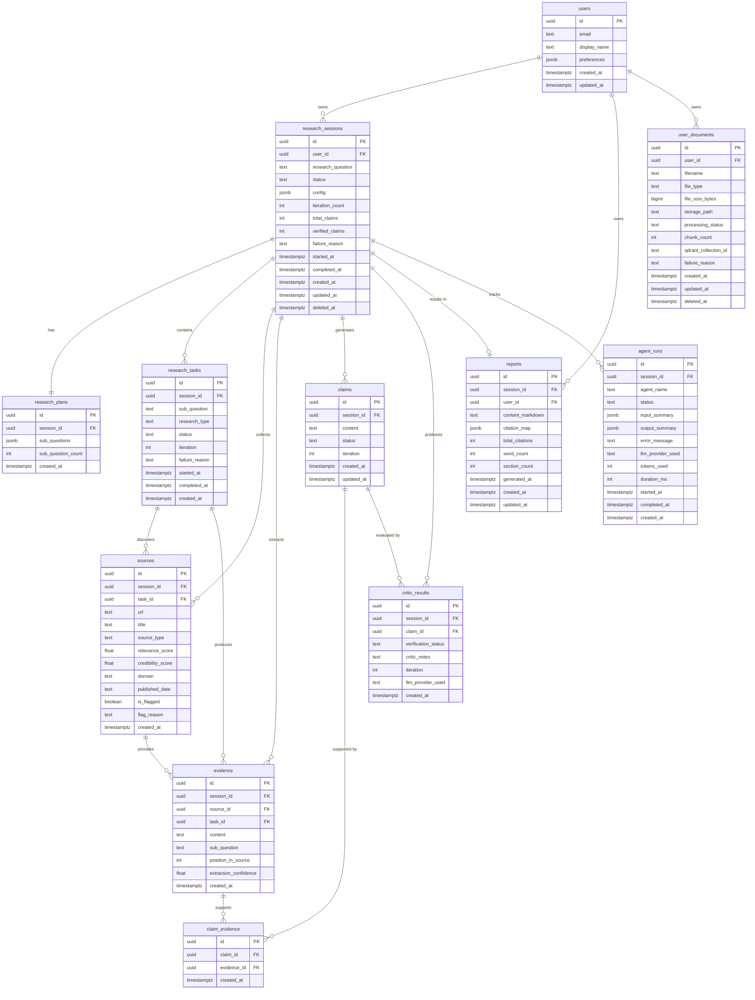

# DATABASE_SCHEMA.md — Database Schema Document

> **Status:** Specification Frozen
> **Version:** 1.0.0
> **Last Updated:** 2026-09-16
> **Owner:** ResearchPilot AI Project
>
> **Important:** This document describes the intended data model. SQL migrations have NOT been created yet. Do not treat this as executable SQL.

---

## Table of Contents

1. [Database Design Principles](#database-design-principles)
2. [Entity Relationship Diagram](#entity-relationship-diagram)
3. [Table Definitions](#table-definitions)
4. [Relationships](#relationships)
5. [Indexing Strategy](#indexing-strategy)
6. [Data Retention](#data-retention)
7. [User Data Isolation](#user-data-isolation)
8. [Supabase Considerations](#supabase-considerations)
9. [Row-Level Security Strategy](#row-level-security-strategy)

---

## Database Design Principles

| Principle | Rationale |
|-----------|-----------|
| **UUID primary keys** | Avoid sequential integer IDs that leak record counts; safe for distributed inserts |
| **`created_at` and `updated_at` on every table** | Auditability; required for data retention and debugging |
| **Soft deletes via `deleted_at`** | Preserve data for auditing and recovery; don't hard-delete immediately |
| **User ID on every user-owned table** | Enables Row-Level Security without joins |
| **JSONB for flexible agent data** | Agent outputs like `evidence_snippets` and `critic_notes` have variable structure; store as JSONB |
| **Normalized claims and evidence** | Claims and evidence are separate tables linked many-to-many via `claim_evidence` to support citation tracing |
| **Enum types for status fields** | Enforces valid state transitions at the database level |
| **No application-level cascades** | Use `ON DELETE CASCADE` only where data cannot exist without its parent; document each decision |

---

## Entity Relationship Diagram



---

## Table Definitions

### `users`

Synced from Supabase Auth. The `id` must match `auth.users.id` from the Supabase Auth schema.

| Column | Type | Nullable | Default | Notes |
|--------|------|----------|---------|-------|
| `id` | `uuid` | No | — | Must match `auth.users.id`; not auto-generated |
| `email` | `text` | No | — | Synced from auth; unique |
| `display_name` | `text` | Yes | `NULL` | User-facing name |
| `preferences` | `jsonb` | Yes | `'{}'` | User preferences (theme, default config, etc.) |
| `created_at` | `timestamptz` | No | `now()` | |
| `updated_at` | `timestamptz` | No | `now()` | Updated via trigger |

**Constraints:** `UNIQUE(email)`

---

### `research_sessions`

One record per research job submitted by a user.

| Column | Type | Nullable | Default | Notes |
|--------|------|----------|---------|-------|
| `id` | `uuid` | No | `gen_random_uuid()` | PK |
| `user_id` | `uuid` | No | — | FK → `users.id` |
| `research_question` | `text` | No | — | Original user question; max 1,000 chars enforced at API |
| `status` | `text` | No | `'pending'` | Enum: `pending`, `planning`, `researching`, `verifying`, `writing`, `completed`, `failed`, `cancelled` |
| `config` | `jsonb` | Yes | `'{}'` | Session-level config (max_iterations, source_types, etc.) |
| `iteration_count` | `int` | No | `0` | Number of critic verification cycles completed |
| `total_claims` | `int` | Yes | `NULL` | Populated after synthesis |
| `verified_claims` | `int` | Yes | `NULL` | Populated after critic |
| `failure_reason` | `text` | Yes | `NULL` | Human-readable failure description if `status = failed` |
| `started_at` | `timestamptz` | Yes | `NULL` | When LangGraph execution began |
| `completed_at` | `timestamptz` | Yes | `NULL` | When report was written or session failed |
| `created_at` | `timestamptz` | No | `now()` | |
| `updated_at` | `timestamptz` | No | `now()` | |
| `deleted_at` | `timestamptz` | Yes | `NULL` | Soft delete |

**Constraints:** `FK user_id → users.id ON DELETE CASCADE`
**Status Enum Values:** `pending` → `planning` → `researching` → `verifying` → `writing` → `completed` / `failed` / `cancelled`

---

### `research_plans`

One record per research session. Stores the Planner Agent's decomposition.

| Column | Type | Nullable | Default | Notes |
|--------|------|----------|---------|-------|
| `id` | `uuid` | No | `gen_random_uuid()` | PK |
| `session_id` | `uuid` | No | — | FK → `research_sessions.id`; UNIQUE (one plan per session) |
| `sub_questions` | `jsonb` | No | — | Array of `{id, text, research_type, priority}` objects |
| `sub_question_count` | `int` | No | — | Denormalized count from `sub_questions` array |
| `created_at` | `timestamptz` | No | `now()` | |

**Constraints:** `FK session_id → research_sessions.id ON DELETE CASCADE`; `UNIQUE(session_id)`

---

### `research_tasks`

One record per sub-question per research iteration. Allows tracking which sub-questions were re-researched.

| Column | Type | Nullable | Default | Notes |
|--------|------|----------|---------|-------|
| `id` | `uuid` | No | `gen_random_uuid()` | PK |
| `session_id` | `uuid` | No | — | FK → `research_sessions.id` |
| `sub_question` | `text` | No | — | The specific sub-question text |
| `research_type` | `text` | No | — | Enum: `web`, `academic`, `rag` |
| `status` | `text` | No | `'pending'` | Enum: `pending`, `running`, `completed`, `failed` |
| `iteration` | `int` | No | `1` | Which critic loop iteration spawned this task |
| `failure_reason` | `text` | Yes | `NULL` | |
| `started_at` | `timestamptz` | Yes | `NULL` | |
| `completed_at` | `timestamptz` | Yes | `NULL` | |
| `created_at` | `timestamptz` | No | `now()` | |

**Constraints:** `FK session_id → research_sessions.id ON DELETE CASCADE`

---

### `sources`

Every source discovered during research. Deduplicated by URL within a session.

| Column | Type | Nullable | Default | Notes |
|--------|------|----------|---------|-------|
| `id` | `uuid` | No | `gen_random_uuid()` | PK |
| `session_id` | `uuid` | No | — | FK → `research_sessions.id` |
| `task_id` | `uuid` | No | — | FK → `research_tasks.id` |
| `url` | `text` | No | — | Full URL |
| `title` | `text` | Yes | `NULL` | Page or paper title |
| `source_type` | `text` | No | — | Enum: `web`, `academic_paper`, `preprint`, `private_document` |
| `relevance_score` | `float` | Yes | `NULL` | 0.0–1.0; set by SourceRanker |
| `credibility_score` | `float` | Yes | `NULL` | 0.0–1.0; set by SourceRanker |
| `domain` | `text` | Yes | `NULL` | Extracted domain from URL |
| `published_date` | `text` | Yes | `NULL` | ISO date string if available |
| `is_flagged` | `boolean` | No | `false` | True if credibility is below threshold |
| `flag_reason` | `text` | Yes | `NULL` | Reason for flagging |
| `created_at` | `timestamptz` | No | `now()` | |

**Constraints:** `FK session_id → research_sessions.id ON DELETE CASCADE`; `FK task_id → research_tasks.id`; `UNIQUE(session_id, url)`

---

### `evidence`

Verbatim extracted text snippets from sources.

| Column | Type | Nullable | Default | Notes |
|--------|------|----------|---------|-------|
| `id` | `uuid` | No | `gen_random_uuid()` | PK |
| `session_id` | `uuid` | No | — | FK → `research_sessions.id` |
| `source_id` | `uuid` | No | — | FK → `sources.id` |
| `task_id` | `uuid` | No | — | FK → `research_tasks.id` |
| `content` | `text` | No | — | Verbatim extracted text |
| `sub_question` | `text` | No | — | The sub-question this evidence addresses |
| `position_in_source` | `int` | Yes | `NULL` | Character offset in source content |
| `extraction_confidence` | `float` | Yes | `NULL` | LLM confidence score for relevance |
| `created_at` | `timestamptz` | No | `now()` | |

**Constraints:** `FK session_id → research_sessions.id ON DELETE CASCADE`; `FK source_id → sources.id ON DELETE CASCADE`

---

### `claims`

Discrete, verifiable assertions generated from evidence by the Synthesis Agent.

| Column | Type | Nullable | Default | Notes |
|--------|------|----------|---------|-------|
| `id` | `uuid` | No | `gen_random_uuid()` | PK |
| `session_id` | `uuid` | No | — | FK → `research_sessions.id` |
| `content` | `text` | No | — | The claim text |
| `status` | `text` | No | `'pending'` | Enum: `pending`, `verified`, `unverified`, `contradicted`, `excluded` |
| `iteration` | `int` | No | `1` | Iteration in which this claim was generated |
| `created_at` | `timestamptz` | No | `now()` | |
| `updated_at` | `timestamptz` | No | `now()` | |

**Constraints:** `FK session_id → research_sessions.id ON DELETE CASCADE`

---

### `claim_evidence`

Many-to-many junction: which evidence items support which claims.

| Column | Type | Nullable | Default | Notes |
|--------|------|----------|---------|-------|
| `id` | `uuid` | No | `gen_random_uuid()` | PK |
| `claim_id` | `uuid` | No | — | FK → `claims.id` |
| `evidence_id` | `uuid` | No | — | FK → `evidence.id` |
| `created_at` | `timestamptz` | No | `now()` | |

**Constraints:** `FK claim_id → claims.id ON DELETE CASCADE`; `FK evidence_id → evidence.id ON DELETE CASCADE`; `UNIQUE(claim_id, evidence_id)`

---

### `critic_results`

One record per Critic Agent evaluation of a claim.

| Column | Type | Nullable | Default | Notes |
|--------|------|----------|---------|-------|
| `id` | `uuid` | No | `gen_random_uuid()` | PK |
| `session_id` | `uuid` | No | — | FK → `research_sessions.id` |
| `claim_id` | `uuid` | No | — | FK → `claims.id` |
| `verification_status` | `text` | No | — | Enum: `verified`, `unverified`, `contradicted` |
| `critic_notes` | `text` | Yes | `NULL` | LLM explanation of the verification decision |
| `iteration` | `int` | No | — | Critic loop iteration number |
| `llm_provider_used` | `text` | Yes | `NULL` | Which LLM provider served this call |
| `created_at` | `timestamptz` | No | `now()` | |

**Constraints:** `FK session_id → research_sessions.id ON DELETE CASCADE`; `FK claim_id → claims.id ON DELETE CASCADE`

---

### `reports`

The final generated report. One report per research session.

| Column | Type | Nullable | Default | Notes |
|--------|------|----------|---------|-------|
| `id` | `uuid` | No | `gen_random_uuid()` | PK |
| `session_id` | `uuid` | No | — | FK → `research_sessions.id`; UNIQUE |
| `user_id` | `uuid` | No | — | FK → `users.id`; denormalized for RLS efficiency |
| `content_markdown` | `text` | No | — | Full Markdown report content |
| `citation_map` | `jsonb` | No | — | Map of citation markers to source IDs: `{"[1]": "source-uuid", ...}` |
| `total_citations` | `int` | No | — | Count of unique cited sources |
| `word_count` | `int` | Yes | `NULL` | Computed from `content_markdown` |
| `section_count` | `int` | Yes | `NULL` | Number of Markdown H2 sections |
| `generated_at` | `timestamptz` | No | `now()` | When the Writer Agent completed |
| `created_at` | `timestamptz` | No | `now()` | |
| `updated_at` | `timestamptz` | No | `now()` | |

**Constraints:** `FK session_id → research_sessions.id ON DELETE CASCADE`; `FK user_id → users.id`; `UNIQUE(session_id)`

---

### `agent_runs`

Observability log: one record per agent invocation per session. Complements Langfuse traces.

| Column | Type | Nullable | Default | Notes |
|--------|------|----------|---------|-------|
| `id` | `uuid` | No | `gen_random_uuid()` | PK |
| `session_id` | `uuid` | No | — | FK → `research_sessions.id` |
| `agent_name` | `text` | No | — | e.g. `planner`, `web_research`, `critic` |
| `status` | `text` | No | — | Enum: `running`, `completed`, `failed` |
| `input_summary` | `jsonb` | Yes | `NULL` | Trimmed summary of input (not full content) |
| `output_summary` | `jsonb` | Yes | `NULL` | Trimmed summary of output |
| `error_message` | `text` | Yes | `NULL` | Error if status = failed |
| `llm_provider_used` | `text` | Yes | `NULL` | Provider that served the LLM call |
| `tokens_used` | `int` | Yes | `NULL` | Token count if available from provider |
| `duration_ms` | `int` | Yes | `NULL` | Wall-clock duration in milliseconds |
| `started_at` | `timestamptz` | Yes | `NULL` | |
| `completed_at` | `timestamptz` | Yes | `NULL` | |
| `created_at` | `timestamptz` | No | `now()` | |

**Constraints:** `FK session_id → research_sessions.id ON DELETE CASCADE`

---

### `user_documents` (P1)

Documents uploaded by users for RAG-based research.

| Column | Type | Nullable | Default | Notes |
|--------|------|----------|---------|-------|
| `id` | `uuid` | No | `gen_random_uuid()` | PK |
| `user_id` | `uuid` | No | — | FK → `users.id` |
| `filename` | `text` | No | — | Original filename |
| `file_type` | `text` | No | — | MIME type: `application/pdf`, `text/plain`, etc. |
| `file_size_bytes` | `bigint` | No | — | File size in bytes |
| `storage_path` | `text` | No | — | Supabase Storage path |
| `processing_status` | `text` | No | `'pending'` | Enum: `pending`, `processing`, `completed`, `failed` |
| `chunk_count` | `int` | Yes | `NULL` | Number of vector chunks created |
| `qdrant_collection_id` | `text` | Yes | `NULL` | Qdrant collection name for this user |
| `failure_reason` | `text` | Yes | `NULL` | |
| `created_at` | `timestamptz` | No | `now()` | |
| `updated_at` | `timestamptz` | No | `now()` | |
| `deleted_at` | `timestamptz` | Yes | `NULL` | Soft delete; triggers vector cleanup |

**Constraints:** `FK user_id → users.id ON DELETE CASCADE`

---

## Relationships

| Relationship | Type | Notes |
|-------------|------|-------|
| `users` → `research_sessions` | One-to-Many | A user has many research sessions |
| `research_sessions` → `research_plans` | One-to-One | Each session produces one plan |
| `research_sessions` → `research_tasks` | One-to-Many | A session spawns multiple tasks |
| `research_tasks` → `sources` | One-to-Many | Each task discovers multiple sources |
| `sources` → `evidence` | One-to-Many | Each source yields multiple evidence items |
| `claims` ↔ `evidence` | Many-to-Many | Via `claim_evidence` junction table |
| `claims` → `critic_results` | One-to-Many | Each claim may be evaluated multiple times (one per iteration) |
| `research_sessions` → `reports` | One-to-One | A completed session produces one report |
| `users` → `user_documents` | One-to-Many | A user can upload multiple documents |

---

## Indexing Strategy

| Table | Index | Type | Rationale |
|-------|-------|------|-----------|
| `research_sessions` | `(user_id)` | B-tree | Research history query by user |
| `research_sessions` | `(user_id, status)` | B-tree | Filter active/completed sessions per user |
| `research_sessions` | `(created_at DESC)` | B-tree | Chronological ordering of history |
| `research_tasks` | `(session_id)` | B-tree | Tasks per session |
| `sources` | `(session_id)` | B-tree | Sources per session |
| `sources` | `(session_id, url)` | B-tree | Deduplication check (also enforced by UNIQUE) |
| `evidence` | `(session_id)` | B-tree | Evidence per session |
| `evidence` | `(source_id)` | B-tree | Evidence per source |
| `claims` | `(session_id)` | B-tree | Claims per session |
| `claims` | `(session_id, status)` | B-tree | Filter unverified claims for retry loop |
| `claim_evidence` | `(claim_id)` | B-tree | Evidence lookup per claim |
| `claim_evidence` | `(evidence_id)` | B-tree | Claims using a given evidence item |
| `critic_results` | `(session_id)` | B-tree | Critic results per session |
| `critic_results` | `(claim_id)` | B-tree | Critic history per claim |
| `reports` | `(user_id)` | B-tree | Reports per user (denormalized for RLS) |
| `agent_runs` | `(session_id)` | B-tree | Observability query per session |
| `user_documents` | `(user_id)` | B-tree | Documents per user |

> Review index usage after baseline traffic data is available. Remove indexes that are never used.

---

## Data Retention

| Data Type | Retention Policy | Rationale |
|-----------|-----------------|-----------|
| Completed research sessions + reports | Indefinite (user-controlled) | Users expect their history to persist |
| Failed sessions | 30 days, then soft-delete eligible | Debugging value; then reduce storage |
| `agent_runs` | 30 days | Observability use; long-term storage not justified on free tier |
| `evidence` + `sources` | Linked to session lifetime | Deleted with session |
| User documents (P1) | Until user deletes + soft-delete | User owns their data |
| Qdrant vectors (P1) | Deleted when `user_documents.deleted_at` is set | Requires cleanup job |

> A background data retention job must be planned before production launch. Not implemented for MVP.

---

## User Data Isolation

All tables containing user data include either a direct `user_id` column or are reachable via `session_id → research_sessions.user_id`.

RLS policies must prevent cross-user data access even if the API layer is misconfigured. The database is the last line of defense.

### Isolation Chain

```
users.id
  → research_sessions.user_id
    → research_plans.session_id
    → research_tasks.session_id
    → sources.session_id
    → evidence.session_id
    → claims.session_id
    → claim_evidence (via claims)
    → critic_results.session_id
    → agent_runs.session_id
    → reports.user_id (denormalized for direct RLS)
  → user_documents.user_id
```

---

## Supabase Considerations

### Auth Integration

- The `users` table in the public schema mirrors `auth.users`. A database trigger must keep them in sync on user creation.
- RLS policies use `auth.uid()` to get the authenticated user's ID without a JOIN.

### Free Tier Limits

| Resource | Supabase Free Tier Limit |
|----------|--------------------------|
| Database storage | 500 MB |
| File storage | 1 GB |
| Auth users | 50,000 |
| API requests | Unlimited (rate-limited by DB connections) |
| Realtime connections | 200 |

> Verify current Supabase free tier limits before deployment.

### Connection Pooling

Use Supabase's built-in PgBouncer (Transaction mode) for backend connections. Set pool size appropriate to the backend's concurrency model.

### Realtime

Supabase Realtime is available but **not used** in the MVP. SSE is served directly from the backend. Do not add Supabase Realtime dependency without architectural justification.

---

## Row-Level Security Strategy

RLS must be enabled on all tables in the `public` schema. Policies are defined conceptually here. SQL implementation comes in the migration phase.

### Policy Patterns

| Table | SELECT | INSERT | UPDATE | DELETE |
|-------|--------|--------|--------|--------|
| `users` | `id = auth.uid()` | Via trigger only | `id = auth.uid()` | Forbidden (use Supabase Auth) |
| `research_sessions` | `user_id = auth.uid()` | `user_id = auth.uid()` | `user_id = auth.uid()` | `user_id = auth.uid()` (soft delete) |
| `research_plans` | Via `session_id` join | Backend service role | Forbidden | Via session |
| `research_tasks` | Via `session_id` join | Backend service role | Backend service role | Via session |
| `sources` | Via `session_id` join | Backend service role | Backend service role | Via session |
| `evidence` | Via `session_id` join | Backend service role | Forbidden | Via session |
| `claims` | Via `session_id` join | Backend service role | Backend service role | Via session |
| `claim_evidence` | Via `claim_id` join | Backend service role | Forbidden | Via claim |
| `critic_results` | Via `session_id` join | Backend service role | Forbidden | Via session |
| `reports` | `user_id = auth.uid()` | Backend service role | Backend service role | `user_id = auth.uid()` |
| `agent_runs` | Via `session_id` join | Backend service role | Backend service role | Via session |
| `user_documents` | `user_id = auth.uid()` | `user_id = auth.uid()` | `user_id = auth.uid()` | `user_id = auth.uid()` |

### Service Role Policy

The backend uses the Supabase **service role key** for write operations that the user cannot directly trigger (e.g., writing agent_runs, evidence, claims). The service role bypasses RLS. This is intentional and requires that the service role key is **never exposed to the frontend**.

The frontend uses the Supabase **anon key** only, and all reads are gated by RLS.
