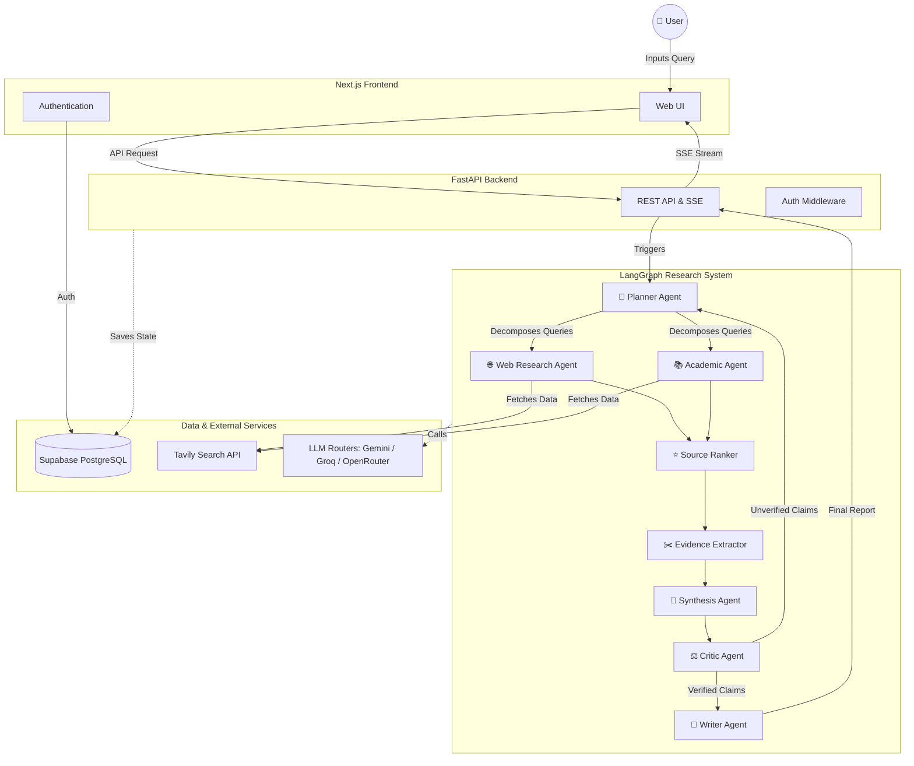
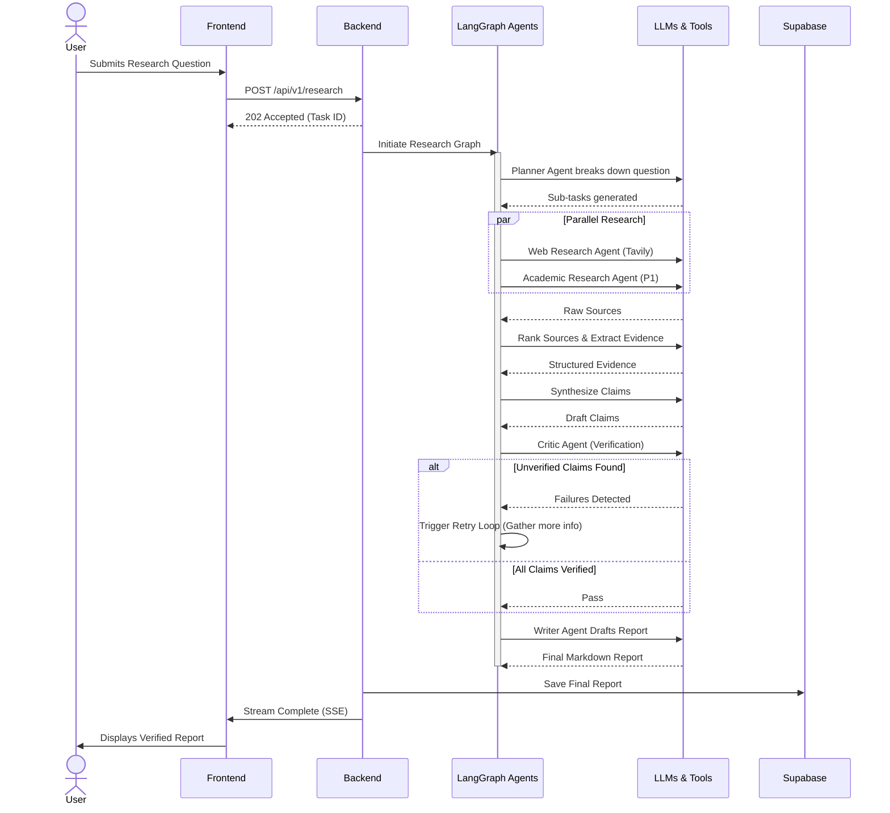

<div align="center">
  <h1>🚀 ResearchPilot AI</h1>
  <p><b>An autonomous multi-agent research platform for structured, verifiable, citation-backed intelligence.</b></p>
  
  []()
  []()
  []()
  []()
  []()
  []()
  []()
</div>

---

## 🌟 Vision

Manual research is broken. Synthesizing information from multiple sources, verifying claims, tracing citations, and composing a coherent report takes hours. Most AI tools paper over this problem with faster hallucinations.

ResearchPilot AI treats research as a **structured, verifiable process**. 
- 🎯 **Grounded Claims:** Every claim is grounded in evidence.
- 🔗 **Traceable Sources:** Every evidence item is traceable to a source.
- ⚖️ **Credibility Ranking:** Every source is ranked for credibility.
- 🛡️ **Critical Verification:** A dedicated Critic Agent challenges every claim before it reaches the final report.

The goal is not faster research. It is **more trustworthy research**.

---

## 🏗️ Architecture & Workflow

ResearchPilot AI is orchestrated by LangGraph, routing dynamic tasks to specialized AI agents.

### System Architecture



### Research Workflow



---

## 📊 Empirical Evaluation & Production Metrics

ResearchPilot AI was evaluated across **10 complex, multi-domain technical queries** (covering AI/ML, LLMs, RAG, Computer Vision, Systems Architecture, and Database Engines) executing through the live production pipeline with end-to-end verification.

> 📄 **Detailed Evaluation Report:** See [`evaluation/README.md`](evaluation/README.md) for benchmark methodology, per-query traces, token ledgers, and database cross-validation tables.

### 🎯 Key Performance Indicators (Empirical Results)

| Metric Category | Measured Metric | Production Result | Architectural Context |
| :--- | :--- | :---: | :--- |
| **Verification & Integrity** | **Claim Verification Rate** | **97.22%** | 70 of 72 generated factual claims verified by CriticAgent |
| | **Citation Failure Rate** | **0.0%** | 0 broken citations, 0 raw UUID leaks, 0 orphan claims |
| | **Citation Integrity** | **100%** | All source claims mapped cleanly to external URLs |
| **Information Extraction** | **Sources Discovered** | **118 sources** | Multi-query Tavily web retrieval |
| | **Sources Retained** | **52 sources** | Surviving credibility and relevance ranking |
| | **Factual Evidence Extracted** | **75 items** | Grounded verbatim excerpts saved to PostgreSQL |
| | **Synthesized Claims** | **72 claims** | Deduplicated propositions synthesized from evidence |
| **Latency & Speed** | **Mean E2E Latency** | **195.92s** (~3.2 min) | Full deep research with iterative multi-agent verification |
| | **Median E2E Latency** | **208.61s** | Typical run duration range: 153.45s – 213.02s |
| **Token Usage & Cost** | **Average Cost / Report** | **$0.0109** (~1.1¢) | Gemini 2.0 Flash pricing ($0.075/1M in, $0.30/1M out) |
| | **Total Tokens / Report** | **114,590 tokens** | Deep research context (104,447 in / 10,143 out avg) |
| | **Physical LLM Calls / Query** | **53.25 calls** | Multi-agent execution (Range: 41 – 60 calls) |

---

### ⏱️ Stage-by-Stage Latency Breakdown

Empirically measured breakdown of an average ~200s deep research run:

```mermaid
gantt
    title Typical Pipeline Latency per Run (~200 seconds)
    dateFormat X
    axisFormat %s s
    section Multi-Agent Graph
    Planning (PlannerAgent)           :done, plan, 0, 4
    Web Retrieval (Tavily)            :done, search, 4, 10
    Source Ranking (SourceRanker)      :done, rank, 10, 11
    Evidence Extraction (Extractor)    :active, extract, 11, 155
    Claim Synthesis (SynthesisAgent)  :done, synth, 155, 160
    Critic Verification (CriticAgent) :done, critic, 160, 165
    Report Generation (WriterAgent)    :done, write, 165, 170
```



- **Evidence Extraction (120–150s, ~70% of total time)**: Sequential and batched LLM calls extracting verifiable claims while honoring rate limits.
- **Agent Reasoning & Writing (<15s combined)**: Fast execution across Planning, Synthesis, Critic, and Writer agents.

---

### 🔍 Per-Domain Benchmark Highlights

| Category | Query Focus | Sources (Disc / Ret) | Claims (Gen / Ver) | Tokens | Latency | Status | Cost |
| :--- | :--- | :---: | :---: | ---: | :---: | :---: | ---: |
| **Python** | uv vs pip/poetry package management | 20 / 13 (65.0%) | 13 / 13 (**100%**) | 78,149 | 204.42s | `completed` | $0.0076 |
| **LLMs** | LLaMA 3 vs Mistral/Mixtral architecture | 38 / 20 (52.6%) | 25 / 24 (**96.0%**) | 139,207 | 212.79s | `completed` | $0.0137 |
| **Comp Vision** | Vision-language models for docs | 26 / 8 (30.8%) | 19 / 18 (**94.7%**) | 113,699 | 153.45s | `completed` | $0.0105 |
| **Software Eng** | Next.js monolith vs micro-frontend | 34 / 11 (32.4%) | 15 / 15 (**100%**) | 127,306 | 213.02s | `completed` | $0.0116 |

---

### 🛡️ Citation & Quality Verification Audit

Rigorous regex and structural audit conducted across all generated reports:

| Audit Criterion | Checked Scope | Failures Detected | Quality Score |
| :--- | :---: | :---: | :---: |
| **Broken Citation References** (`[N]` lacking source) | 4 reports | 0 | 100% |
| **Raw Database UUID Leaks** (`[0-9a-fA-F-]{36}`) | 4 reports | 0 | 100% |
| **Orphan Claims** (No supporting evidence attached) | 72 claims | 0 | 100% |
| **Orphan Evidence** (Not tied to valid source URL) | 75 items | 0 | 100% |
| **Invalid External Links** (Bad domain / dead targets) | 29 links | 0 | 100% |

---

## 🛠️ Technology Stack

| Layer | Technology |
|-------|-----------|
| **Frontend** | Next.js (App Router), TypeScript, Tailwind CSS |
| **Backend** | Python, FastAPI, LangGraph, LangChain, Pydantic |
| **Database** | Supabase (PostgreSQL + Auth) |
| **Vector DB** | Qdrant Cloud (P1) |
| **Primary LLM** | Google Gemini API |
| **Fallback LLMs**| Groq API, OpenRouter |
| **Web Research** | Tavily |
| **Academic** | Semantic Scholar, arXiv (P1) |
| **Observability**| Langfuse |
| **Deployments**  | Vercel (Frontend), Railway (Backend recommended) |
| **CI/CD & DevOps**| GitHub Actions, Docker |

---

## 📁 Repository Structure

```text
ResearchPilot AI/
├── frontend/          # Next.js frontend
├── backend/           # FastAPI backend
│   ├── app/
│   │   ├── api/       # HTTP endpoints
│   │   ├── agents/    # Research agents
│   │   ├── graph/     # LangGraph state machine
│   │   ├── tools/     # External API wrappers
│   │   ├── llm/       # LLM provider abstraction
│   │   ├── services/  # Application services
│   │   ├── schemas/   # Pydantic data models
│   │   ├── models/    # Database models
│   │   ├── core/      # Config, security, logging
│   │   └── prompts/   # LLM prompt templates
│   └── tests/
├── evaluation/        # Research quality evaluation scripts
├── docs/              # Specifications and technical documentation
│   ├── AGENTS.md          # AI Coding Agent Instruction Manual
│   ├── API_SPEC.md        # API Contract Document
│   ├── ARCHITECTURE.md    # System Architecture Document
│   ├── DATABASE_SCHEMA.md # Database Schema Document
│   ├── DESIGN_SYSTEM.md   # Design System Document
│   ├── PRD.md             # Product Requirements Document
│   ├── UI_UX_SPEC.md      # UI/UX Specification
│   ├── USER_FLOWS.md      # User Journey Document
│   ├── V1_FREEZE.md       # V1 Specification Freeze
│   └── decisions/         # Architecture Decision Records
├── .github/workflows/ # CI/CD pipelines
└── .env.example       # Environment variable template
```

---

## ⚙️ Environment Setup

### Prerequisites
- Python 3.11+
- Node.js 20+
- Docker (optional for local database)

### Quickstart

1. **Clone the repository**
   ```bash
   git clone https://github.com/YOUR_ORG/researchpilot-ai.git
   cd researchpilot-ai
   ```

2. **Configure environment variables**
   ```bash
   cp .env.example .env
   ```
   *Edit `.env` with your actual API keys. See [`.env.example`](.env.example) for required variables.*

3. **Backend Setup** (After Phase 1)
   ```bash
   cd backend
   uv sync
   uv run uvicorn app.main:app --reload
   ```

4. **Frontend Setup** (After Phase 1)
   ```bash
   cd frontend
   npm install
   npm run dev
   ```

---

## 💰 Free-Tier Strategy

ResearchPilot AI is designed to run entirely on free-tier infrastructure during development:

| Service | Free Tier Summary |
|---------|-------------------|
| **Supabase** | 500MB DB, 1GB storage, 50K auth users |
| **Google Gemini** | Rate-limited free tier |
| **Groq / OpenRouter**| Free tier with rate limits / Free models |
| **Tavily** | 1,000 credits/month |
| **Qdrant Cloud** | 1 cluster, 1GB, 1M vectors (P1) |
| **Langfuse Cloud** | Generous free tier |
| **Vercel / Railway** | Next.js free tier / Starter allowances |

> **Note:** The free-tier architecture has limitations (e.g., single backend process, rate limits). The system is designed to scale beyond free tier without rewrites. See `ARCHITECTURE.md` for Scalability details.

---

## 🩺 Production Health Check

ResearchPilot AI provides two production-safe health monitoring endpoints:

- 🟢 **Liveness Probe (`GET /api/v1/health`)**:
  - Lightweight process check used by load balancers. Returns `HTTP 200` as long as the Python backend is alive. No external calls.

- 🔵 **Deep Health Probe (`GET /api/v1/health/deep`)**:
  - Verifies backend activity **and** read-only communication with Supabase PostgreSQL.
  - Executes a minimal read-only query (`SELECT id FROM research_sessions LIMIT 1`) with a bounded timeout (`5.0s`).
  - **Does NOT** trigger research pipelines, LLM calls, Tavily searches, or mutations.
  - Recommended interval for uptime monitors (like Better Uptime): **Every 4 to 6 hours**.

---

## 🛡️ Security & Testing

- **Security:**
  - API keys stored securely as environment variables.
  - Supabase Row-Level Security (RLS) enforces data isolation.
  - JWT tokens validated on every protected backend request.
  - Mitigations against prompt injections in place.
- **Testing:**
  - Strict requirement for unit tests on every agent, tool, and LLM router.
  - Integration tests run against isolated test databases.
  - *No fabricated test results allowed.*

---

## 📚 Documentation Index

| Document | Purpose |
|----------|---------|
| [PRD.md](docs/PRD.md) | Product requirements, features, success metrics, risks |
| [ARCHITECTURE.md](docs/ARCHITECTURE.md) | System architecture, agent design, data flow, security |
| [AGENTS.md](docs/AGENTS.md) | AI coding agent rules, folder structure, coding standards |
| [DATABASE_SCHEMA.md](docs/DATABASE_SCHEMA.md) | Data model, table definitions, RLS strategy |
| [API_SPEC.md](docs/API_SPEC.md) | API contract, endpoints, SSE event format |
| [DESIGN_SYSTEM.md](docs/DESIGN_SYSTEM.md) | Color palette, typography, component patterns |
| [USER_FLOWS.md](docs/USER_FLOWS.md) | User journeys and flow diagrams |
| [UI_UX_SPEC.md](docs/UI_UX_SPEC.md) | UI/UX specifications and UI component plans |
| [V1_FREEZE.md](docs/V1_FREEZE.md) | Summary of the V1 specification freeze |
| [.env.example](.env.example) | Environment variable template with documentation |

---

## 🤝 Contributing

Before writing any code:
1. Read `AGENTS.md` — it defines the rules for all code contributions.
2. Read `ARCHITECTURE.md` — it defines what can and cannot be changed.
3. Read the relevant feature spec in `PRD.md`.

> Do not introduce new dependencies, frameworks, or services without updating `ARCHITECTURE.md` and receiving acknowledgment.

---
*License: TBD — to be determined before public launch.*
