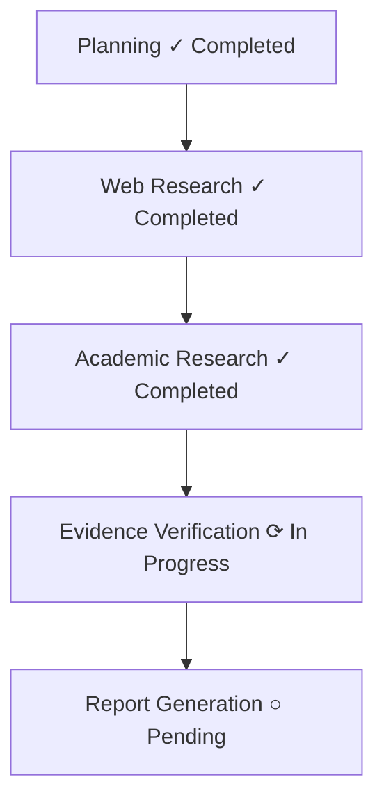

# UI/UX Specification

> **Status:** Specification Frozen
> **Version:** 1.0.0
> **Last Updated:** 2026-09-16
> **Owner:** ResearchPilot AI Project

---

## FUTURE IMPLEMENTATION RULE: STITCH MCP

**Do NOT use Stitch MCP during this documentation-only phase.**

When the project reaches the actual UI/UX generation/implementation phase, the following workflow must be followed:

1. Finalized Design System
2. Google Stitch MCP
3. Visual UI exploration / screen design
4. Design review
5. Approved visual direction
6. Antigravity implementation
7. Next.js components

**During implementation, the AI coding agent MUST:**
- Use the available **Stitch MCP** for visual design generation/exploration.
- Use the **UI/UX Pro Max skill** when designing and implementing the frontend.
- Follow `DESIGN_SYSTEM.md` as the visual source of truth.
- Follow `UI_UX_SPEC.md` as the UX/source-of-truth for screens and interactions.
- Never arbitrarily introduce a new color palette.
- Never redesign the product without explicit approval.
- Keep the generated implementation consistent with the approved Stitch designs.
- Inspect the existing frontend architecture before implementing screens.

---

## 1. UX Principles
- **Evidence over decoration**: The interface should make it easy to understand what ResearchPilot found, where, and why it is relevant. Transparency is paramount.
- **Professionalism**: Create an editorial, trustworthy environment. Information should be clean, dense, and well-structured.
- **Traceability**: Users should always be able to trace a claim back to its original source.

## 2. Information Architecture
The core workflow is a sequential flow that allows for deep-dives into sources and evidence.
`Landing → Auth → Dashboard → New Research → Progress Workspace → Final Report`

## 3. Navigation
- **Primary Nav**: Clean top bar with logo, new research button, and user profile.
- **Dashboard Nav**: Subtle sidebar for history, saved reports, and settings. Only visible on the Dashboard.

## 4. Landing Page
Minimal marketing page.
- **Hierarchy**: Navigation → Hero → Primary Research CTA → How ResearchPilot Works → Research Workflow → Example Research Questions → Trust / Evidence explanation → CTA → Footer.
- **Actions**: Sign In / Start Research.
- **Important**: Do not create an excessive or flashy marketing page.

## 5. Authentication
Standard auth flows (Login, Signup, Reset Password).
- Clean, minimal center-aligned card using the `Surface` background.

## 6. Dashboard
- **Priorities**: New Research CTA, Recent Research, Saved Reports, Research Status, Usage/account information.
- **Important**: Avoid dashboard clutter. Do not create unnecessary KPI cards simply because dashboards commonly have them. Every element must have a purpose.

## 7. New Research
- Focused, centered text area for entering complex research questions.
- Examples or templates for common query structures.
- **Action**: "Start Research" primary button (Sage Green).

## 8. Research Workspace
Desktop layout dividing the screen to support multiple streams of information without becoming visually crowded.
- **Left/Center**: Main research progress and output report.
- **Right/Sidebar**: Activity feed, source list, and evidence drill-down.
- **Responsive**: Sequential stacked view on mobile.

## 9. Research Progress
Structured progress indicating discrete steps, avoiding generic "Loading...". It must not expose private model chain-of-thought.

- Includes a compact **Activity Feed** that is visually quiet. (e.g. `16:42 Planner created research questions`).

## 10. Source Explorer
- Presents Source Cards highlighting: Title, Type (Web/Academic/RAG), Publisher/Author, Date, Relevance, Evidence used, Citation reference.
- Does not present unexplained AI-generated confidence scores.

## 11. Evidence View
- Drill-down view into specific claims and the source snippets supporting them.
- Uses `JetBrains Mono` for technical identifiers and exact snippets.

## 12. Verification/Critic Status
- Communicates when the system is evaluating claims or retrying.
- The UI may communicate high-level agent actions such as: "Critic identified claims requiring additional evidence."

## 13. Final Report
- High-quality editorial layout.
- Excellent typography (`Source Serif 4` for body), generous reading width, clear hierarchy, citations, source references, section navigation, readable paragraphs, tables where appropriate, and evidence traceability.

## 14. Report Export
- Options to export as Markdown or PDF.
- Maintains professional styling in the exported asset.

## 15. Research History
- Table view on the dashboard showing past sessions, status, dates, and query snippets.

## 16. Private Document/RAG Flow
- UI for uploading custom documents.
- Clear indication in the progress and source cards that private user documents were utilized.

## 17. Settings
- User preferences, account management, billing, API keys (if applicable).

## 18. Empty States
- Informative and encouraging. Must clearly guide the user to their first action.

## 19. Loading States
- Skeleton loaders (subtle pulses) for lists and reports.
- Avoid large distracting spinners for content areas.

## 20. Error States
- Use semantic Error color (`#B54747`).
- Human-readable messages with clear CTAs (e.g., Retry, Contact Support).

## 21. Partial Failure States
- Handled gracefully. If some sources fail but others succeed, report the findings with a warning indicator.

## 22. Mobile UX
- Stacked layout: `Query → Progress → Findings → Report → Sources`.
- Sticky CTAs where appropriate to maintain workflow control.

## 23. Accessibility
- Color contrast checking, keyboard navigation, focus states (outline, no blur), semantic HTML, screen reader support, accessible forms, touch targets, and reduced motion considerations.
- Do not rely on color alone to communicate status.
