# USER_FLOWS.md — User Journey Document

> **Status:** Specification Frozen
> **Version:** 1.0.0
> **Last Updated:** 2026-09-16
> **Owner:** ResearchPilot AI Project

---

## Table of Contents

1. [First Visit (Unauthenticated)](#first-visit-unauthenticated)
2. [Signup Flow](#signup-flow)
3. [Login Flow](#login-flow)
4. [Core Research Flow](#core-research-flow)
5. [Research Failure Flows](#research-failure-flows)
6. [Private Document RAG Flow (P1)](#private-document-rag-flow-p1)
7. [Report Flow](#report-flow)
8. [Research History Flow](#research-history-flow)
9. [Account Management Flow](#account-management-flow)

---

## First Visit (Unauthenticated)

User arrives at the root URL without an active session.

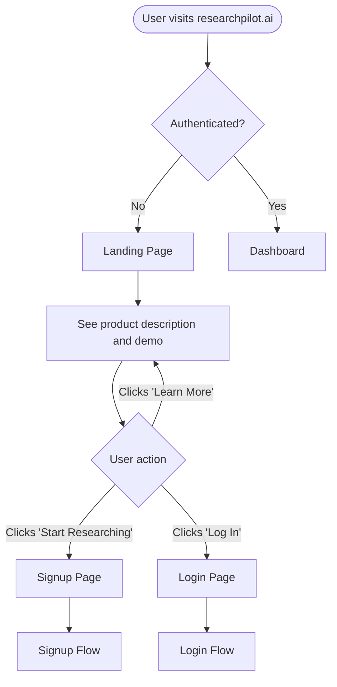

### Landing Page Contents

- Product headline and one-line description
- Brief feature summary (3–4 key points)
- Call-to-action: "Start Researching" → Signup
- Secondary link: "Log In"
- No pricing; no marketing fluff

---

## Signup Flow

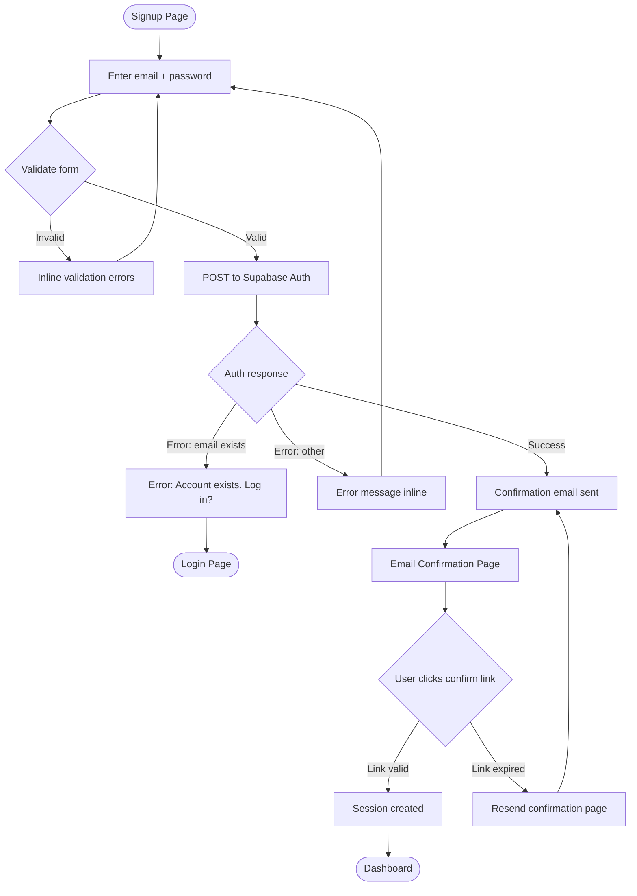

### Notes

- Email confirmation is required before accessing the dashboard.
- Supabase Auth handles confirmation emails.
- No OAuth/social login in MVP. Add Google OAuth as a P1 enhancement.

---

## Login Flow

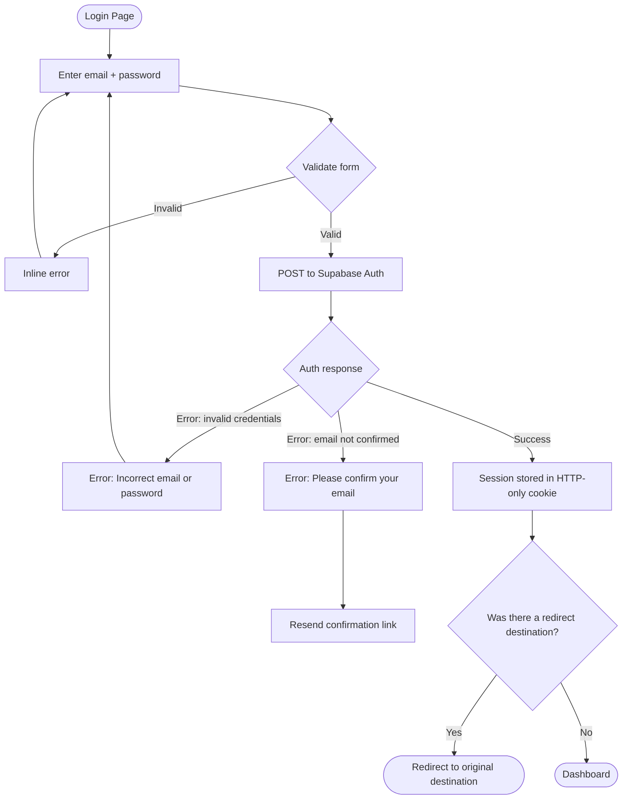

---

## Core Research Flow

The primary user journey. This flow covers the entire research lifecycle from question submission to report.

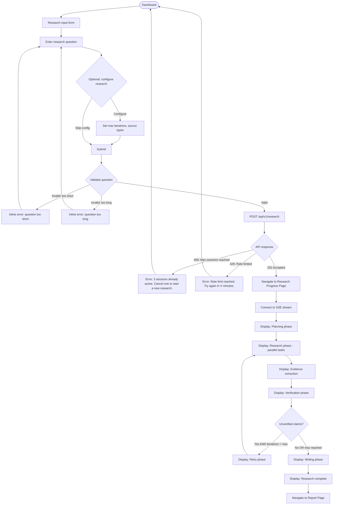

### Research Progress Page Layout

```
┌─────────────────────────────────────────────────────────┐
│  Your Research                               [Cancel ×] │
│  "What are the main mechanisms by which..."             │
├─────────────────────────────────────────────────────────┤
│                                                         │
│  ◉ Searching sources            [02:14 elapsed]         │
│  ━━━━━━━━━━━━━━━━━━━━━━━━━━━━━━ 60%                    │
│                                                         │
│  Research Tasks:                                        │
│  ✓ Attention-based failure modes        5 sources       │
│  ◐ Chain-of-thought limitations         Searching...   │
│  ○ Prompting failure patterns           Queued          │
│  ○ Benchmark saturation                 Queued          │
│                                                         │
│  Agent Activity:                                        │
│  ✓ Planner Agent      Completed    0.8s                 │
│  ◐ Web Research Agent Running     02:14s                │
│                                                         │
└─────────────────────────────────────────────────────────┘
```

---

## Research Failure Flows

### Flow A: Search API Fails

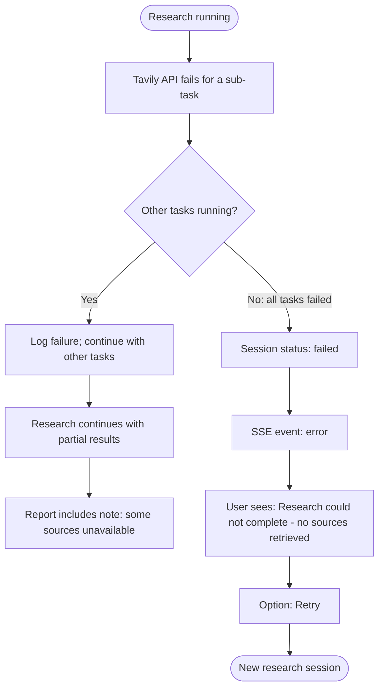

### Flow B: LLM Provider Fails

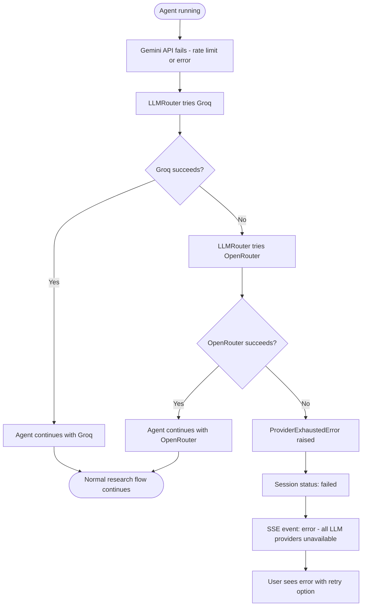

### Flow C: Verification Fails to Resolve

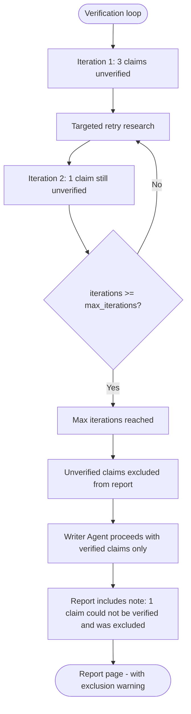

### Flow D: Research Timeout

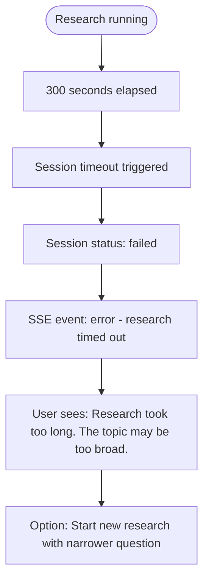

### Flow E: User Cancels Research

```mermaid
flowchart TD
    A([Research progress page]) --> B[User clicks Cancel]
    B --> C[Confirm dialog: Cancel this research?]
    C --> D{User confirms?}
    D -- No --> A
    D -- Yes --> E[DELETE /api/v1/research/{id}]
    E --> F[Session status: cancelled]
    F --> G[SSE connection closed]
    G --> H([Dashboard - session shows as cancelled])
```

---

## Private Document RAG Flow (P1)

> This flow is a P1 feature. Not implemented in MVP.

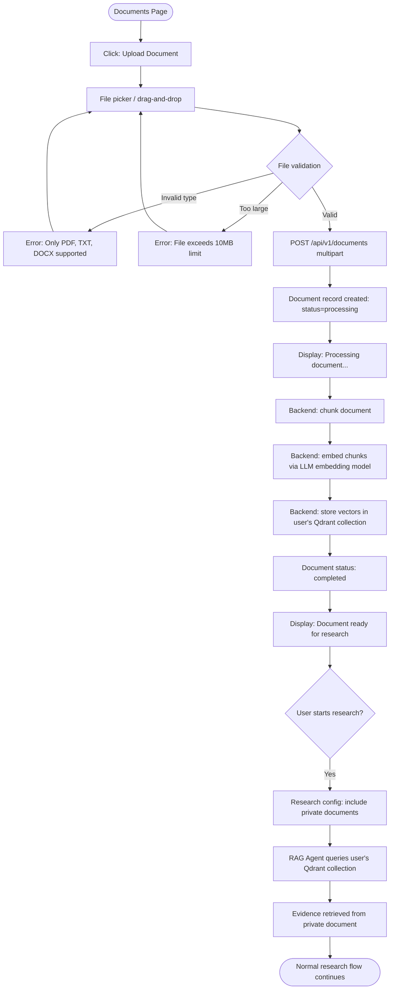

### RAG Research Sub-Flow

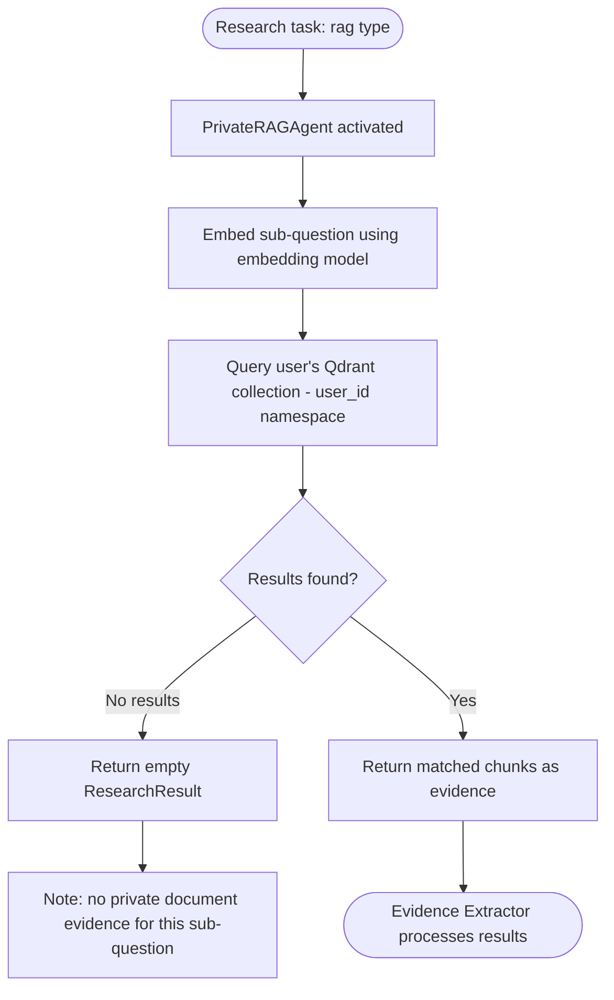

---

## Report Flow

```mermaid
flowchart TD
    A([SSE: event done]) --> B[Navigate to Report Page]
    B --> C[GET /api/v1/research/{id}/report]
    C --> D[Render structured report]

    D --> E[Report sections visible]
    E --> F{User explores report}

    F -- Clicks citation [n] --> G[Highlight source in reference list]
    G --> H[Tooltip: source title, URL, type]

    F -- Clicks source URL --> I[Open source in new tab]

    F -- Clicks 'View Sources' tab --> J[Source list panel]
    J --> K[Show all sources with credibility + relevance scores]
    K --> L{Source is flagged?}
    L -- Yes --> M[Show flag warning: low credibility]
    L -- No --> N[Normal display]

    F -- Clicks 'Export Markdown' --> O[GET /api/v1/research/{id}/report?format=markdown]
    O --> P[Browser downloads report.md file]

    F -- Clicks 'View Claims' tab --> Q[Claim list with verification status]
    Q --> R[Each claim shows: content, status badge, evidence count]
    R --> S{Excluded claims shown?}
    S -- Yes --> T[Shown with 'Excluded' badge and reason]
```

### Report Page Layout

```
┌─────────────────────────────────────────────────────────────┐
│  ← Back to History            [Export Markdown] [PDF (P1)] │
├─────────────────────────────────────────────────────────────┤
│                                                             │
│  Research Report                           [Summary Stats] │
│  "What are the main mechanisms..."         10 claims ✓      │
│  Completed: Sep 16, 2026 · 1m 23s         8 sources cited  │
│                                                             │
│  [Report] [Sources] [Claims] [Agent Log]                   │
├─────────────────────────────────────────────────────────────┤
│                                                             │
│  ## Introduction                                            │
│  Large language models frequently fail at multi-step        │
│  reasoning tasks [1][2] due to...                           │
│                                                             │
│  ## Attention-Based Failures                                │
│  ...                                                        │
│                                                             │
│  ## References                                              │
│  [1] Author et al. (2024). Title. URL                       │
│  [2] Domain.com. Title. URL                                 │
│                                                             │
└─────────────────────────────────────────────────────────────┘
```

---

## Research History Flow

```mermaid
flowchart TD
    A([Dashboard]) --> B[Research history list]
    B --> C{List is empty?}
    C -- Yes --> D[Empty state: Start your first research]
    D --> E[Click: Start Research]
    E --> F([Research input form])
    C -- No --> G[Show sessions: question, status, date, stats]

    G --> H{User action}
    H -- Clicks completed session --> I[Navigate to Report Page]
    H -- Clicks in-progress session --> J[Navigate to Research Progress Page]
    H -- Clicks failed session --> K[Session detail: failure reason + Retry option]
    H -- Clicks delete icon --> L[Confirm: Delete this research?]
    L --> M{Confirmed?}
    M -- No --> G
    M -- Yes --> N[DELETE /api/v1/research/{id}]
    N --> O[Session removed from list]

    G --> P{User filters?}
    P -- Filter by status --> Q[GET /api/v1/research?status=completed]
    Q --> G
    P -- Load more --> R[GET /api/v1/research?page=2]
    R --> G
```

---

## Account Management Flow

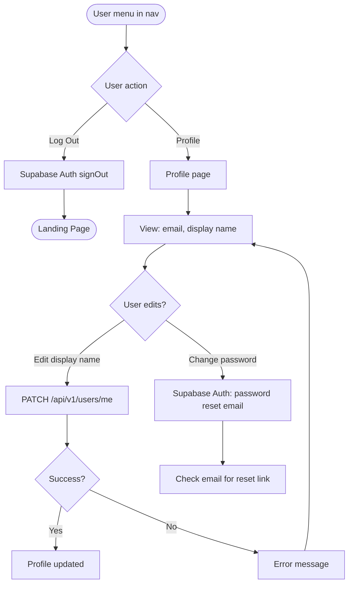
